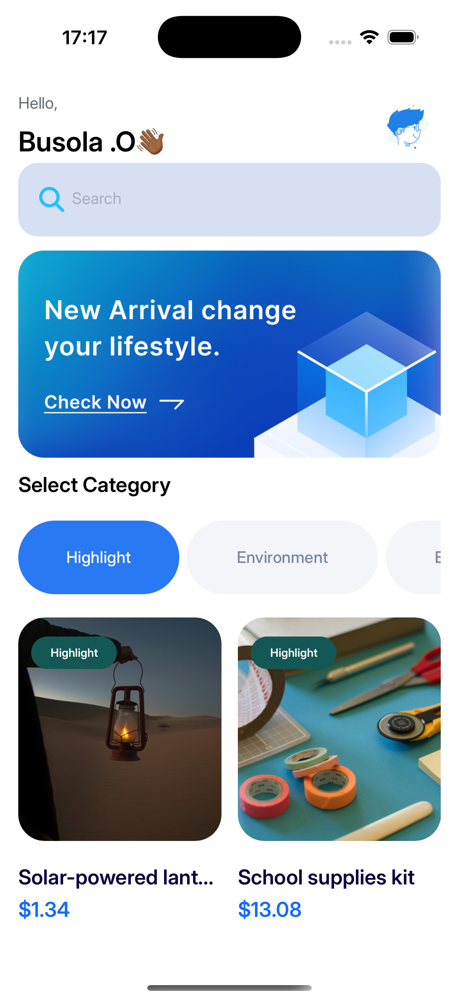
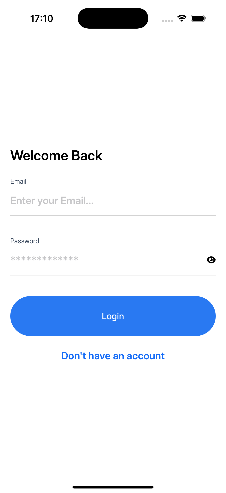
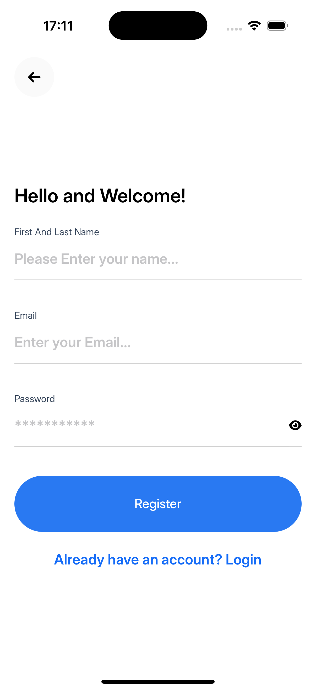
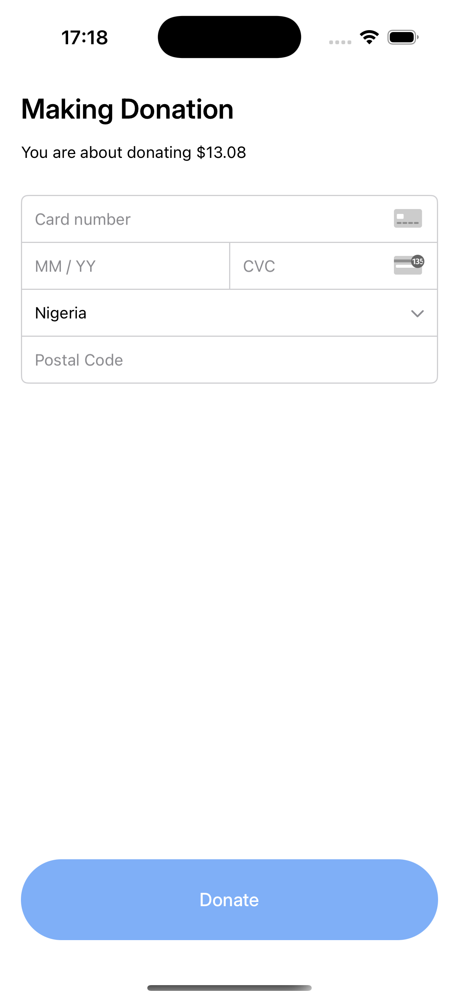
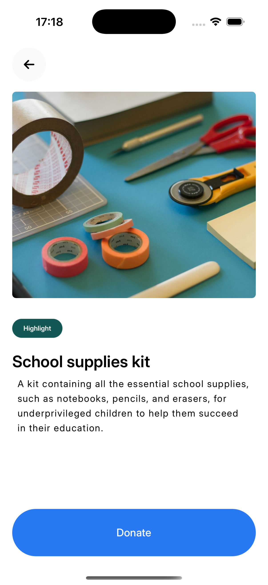

# DonationApp 💖

A simple and intuitive donation app built with **React Native CLI**, designed to make giving easy and secure. The app integrates with **Stripe** to handle seamless and secure payment processing.

---

## 🚀 Features
- 💳 Donate securely via card payments (Stripe)
- 📊 View donation history
- 🔔 Instant confirmation after successful donations
- 🎨 Clean and user-friendly interface
- 🔐 Secure payment flow with Stripe

---

## 📸 Screenshots

<table>
  <tr>
    <td>Home</td>
    <td>Home List</td>
  </tr>
  <tr>
    <td></td>
    <td></td>
  </tr>
  <tr>
    <td>Login</td>
    <td>Sign Up</td>
  </tr>
  <tr>
    <td></td>
    <td></td>
  </tr>
  <tr>
    <td>Payment</td>
    <td>View Donation</td>
  </tr>
  <tr>
    <td></td>
    <td></td>
  </tr>
</table>


---

## 🛠️ Tech Stack
- **React Native CLI**
- **Stripe Payment Integration**
- **React Navigation**
- **Redux Toolkit**
- **AsyncStorage**
- **Firebase (Auth)**
- **FontAwesome Icons**

---

## 🔧 Setup Instructions

### 1️⃣ Clone the Repository
```bash
git clone https://github.com/your-username/DonationApp.git
```

### 2️⃣ Navigate into the Project
```bash
cd DonationApp
```

### 3️⃣ Install Dependencies
```bash
npm install
```

### 4️⃣ Run on Android
```bash
npx react-native run-android
```

### 5️⃣ Run on iOS
```bash
cd ios
pod install
cd ..
npx react-native run-ios
```

---

## 📝 Environment Variables
Create a `.env` file in the root directory with your Stripe keys:

```
STRIPE_PUBLISHABLE_KEY=your_publishable_key_here
STRIPE_SECRET_KEY=your_secret_key_here
```

Ensure your `.env` is listed in `.gitignore`.

---

## 🐛 Common Troubleshooting
If you experience build issues on Android:
```bash
cd android && ./gradlew clean
```
Then re-run:
```bash
npx react-native run-android
```

---

## 🤝 Contributing
Pull requests are welcome.  
For major changes, please open an issue first to discuss your ideas.

---

## 📄 License
This project is licensed under the **MIT License**.

---

## 📬 Contact
For questions, feedback, or collaboration opportunities:
- GitHub: [https://github.com/IfeBusola263](https://github.com/IfeBusola263)

